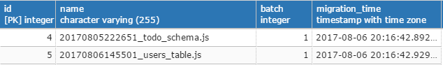
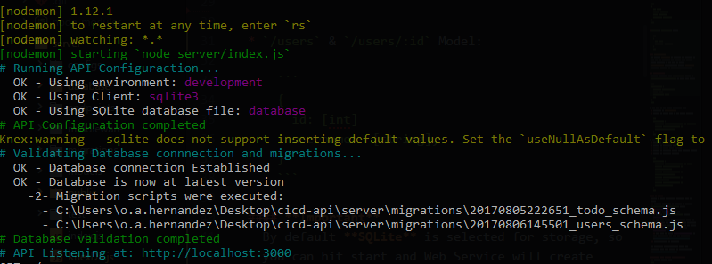

# Configure your machine for development
1. Install Nodemon CLI to run start API Daemon with:  
```
npm install -g nodemon
```

2. Install [KnexJS](http://knexjs.org/#Migrations-API) CLI to handle migrations/seeds manually:  
```
npm install -g knex
```  
3. Install [Docker](https://docs.docker.com/engine/installation/#supported-platforms) for running postgres/api containers

# Getting Started with Example
You have 3 options to run this example.
1. Local API
2. Docker API Image
3. Automated Solution (single solution)

## Whats gonna happen?
This API when ran under an empty database, will generate Its schema and start handling CRUD requests for endpoints:
1. `/_api/v1/todos`
2. `/_api/v1/users`

## How this Works
Having an empty postgressql database, this API will:
1. Validate connection to Database by calling `knex.migrate.currentVersion()` inside _**KnexDB.js**_
2. Validate Databse version by:
  1. Calling `knex.migrate.latest()` inside _**KnexDB.js**_
  2. Knex will detect that databse is empty and will generate its schema by executing migrations sciprts inside `server/migrations` by ASC order: First todo_schema and then users_table
  3. Knex will set table _**knex_migrations**_ to save a checkpoint for this ran migrtions.
  
3. Start listening on port 3000  

If everithing was correct, you should get something like this printed on your terminal:



## **Important!**
Before you start runnig this API, you need to have any postgresql empty database with the following parameters:
* Host - IP Address for the database connection
* Database name - Name for the Database that API will use
* Database user - User which must have permission for given database name
* Database user password - Password for previous user

If you dont have any postgresql database up, you can use the provided docker solution by Running a postgresql container with:  

```
npm run docker-run-postgres
```

This container has the following configuration:
   * Database name (**DB_NAME**): **db_api**
   * Database user (**DB_USER**): **developer**
   * Database user password (**DB_PASS**): **qwerty**
   * Database Host (IP Address):
     * If you are using _LINUX_: Use localhost has **DB_HOST**
     * If you are using _MAC_ or _Windows_, your docker daemon might be running on a docker-machine. Type `docker-machine ip` to get It's IP adress and use it as: **DB_HOST**


## Running local API - Development
This options will let you run this API with your Terminal/Console using Postgres Container. Recommended for development as this uses nodemon to watch any change and restart.
1. Install dependencies  
```
npm install
```
2. Set Database configuration parameters (DB_HOST, DB_USER, ...) into `server/configs/configs.js` module
3. Run API  
```
npm start
```

## Running Docker API Image
This option will build and run a docker image out of this API and will connect to any provided postgressql database configuration
1. Build Image with:  
```
docker build -t ... .
```
2. Run Image by setting Database Env variables (DB_HOST, DB_USER, DB_PASS) with:  
```
docker run --name cicd_api -e DB_HOST="" -e DB_USER="" -e DB_PASS="" -e DB_NAME=""...
```


## Running Automated Solution (Docker-Compose)
This options will generate two containers: One for the API and another for the postgressql

....


# Why CI/CD?
The key for these deatures is [KnexJs](www.knexjs.org) library for comunication between API and DB.

What KnexJS does, is you start using it's own migrations API, It creates a couple of tables on the database provided for handling Database versioning. Basically the information stored in this tables is:
1. A row for each migration script that has been run
2. For all rows, it adds an integer that stores in which migration was executed that script.

Thanks to this, Knex is able to compare which sripts has been executed or not. For Example: If in the migrations folder there are the sripts A, B and C; and database has stored only scipts A and B, next time Knex exetuce its migration API It will execute script C in order to have Database on latest version

# How to Use KneJS Migrations API
You can use It either by CLI or It's own module.

First of all, you need to have configured your _knexfile_ which basically contains the connection object.

```
module.exports = {
  development: {
    client: 'pg',
    connection: {
      host : '127.0.0.1',
      user : 'developer',
      password : 'qwerty',
      database : 'db_api'
    },
    migrations: {
      directory: __dirname + '/migrations'
    },
    seeds: {
      directory: __dirname + '/seeds'
    }
  }
}
```
The, you need to have a folder called 'migrations' (provided at previous connection object). Right there, all your migrations scripts will be stored and Knex have aknowledge of it.

Now, for using the migration API, pretty much you can call it either by CLI or Its own module, but for this example lets use the CLI way.

Finally you need to be in the same path as your 'knexfile', as CLI command is gonna read it to get the connection ojbect.  

## Creating a Migration Script
```
knex migrate:make "Name_Of_Your_Script"
```

This will create on your migrations folder a file named with a timestap and the given name.


### Migration Script Structure
Each script consist in an Up and Down function which are required to return the Promise parameter.
1. Up - Is executed when migration.latests is called
2. Down - Is executed when migration.rollback is called

```
exports.up = function(knex, Promise) {

};

exports.down = function(knex, Promise) {

};
```

## Running a migration
```
knex migrate:latest
```
Knex will execute all scripts that has not been executed scinec last migration

This is the key for having an API with CI/CD. Basically you can call this by:

```
knex.migrate.latest().then...
```
At the initialization of tour API, at It will enforce the database to be on the latest version before the API start recieveing requests.

_**You can see this in action on `KnexDB.js` file**_

## Rollback a migration
```
knex migrate:rollback
```
Knex will execute each scripts from latest migration by calling their `down` function
